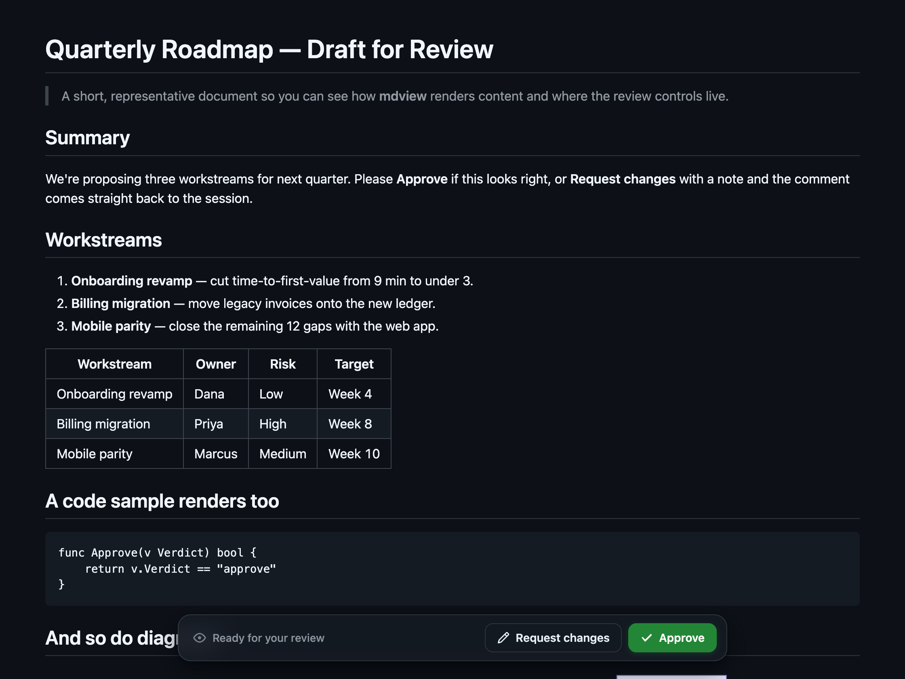
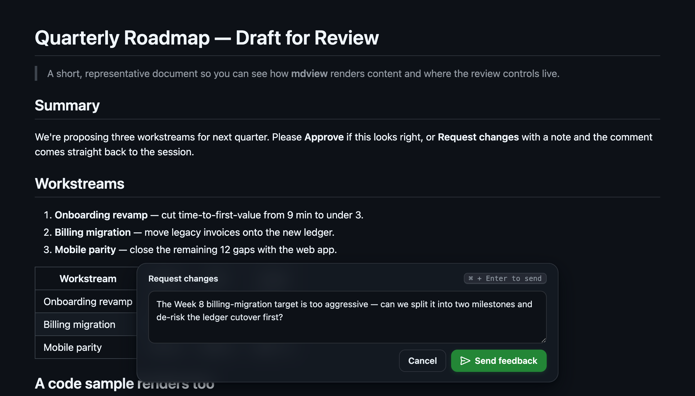

# mdview-review

**Review a markdown document in your browser and send the verdict straight back to your Claude Code session.**

`mdview` renders a markdown file as a clean web page with **Approve** and **Request changes**
buttons pinned to the bottom. Click one, and your decision (and any comment) is reported back
to the waiting Claude Code session — no switching to the terminal to type a reply.



It's a single, self-contained, cross-platform Go binary (macOS / Linux / Windows) with **no
runtime dependencies** — the renderer, styles, and diagram support are all baked in.

## Why

When an agent wants you to review something it wrote — a spec, a plan, a design doc — the
usual flow is "open this file, then tell me what you think." That means leaving the rendered
view, switching windows, and typing. `mdview` collapses that into one place: you read the
rendered doc and decide *in the same page*, and the answer lands back in the session
instantly.

**Request changes** opens a comment box, and your note comes back with the verdict:



## How it works

1. `mdview file.md` renders the doc and serves it on a random `127.0.0.1` port (localhost
   only), then opens your browser to it.
2. It **blocks**, waiting for you to decide. Run it as a background command and the wait is
   unbounded — decide in 5 seconds or 40 minutes, it doesn't matter.
3. When you click a button, the page POSTs your verdict to the local server, which prints one
   line and exits:
   - `MDVIEW_VERDICT {"verdict":"approve"}`
   - `MDVIEW_VERDICT {"verdict":"changes","comment":"…"}`
   - `MDVIEW_VERDICT {"verdict":"dismissed"}` (you closed the tab without deciding)

Because the binary exits the instant you click, the Claude Code session is **notified on
exit** — it's woken by your click, not by polling. Closing the tab, or walking away, resolves
cleanly to `dismissed` so a session never hangs forever.

The page follows your system light/dark theme, and fenced ` ```mermaid ` blocks render as
diagrams.

## Install (Claude Code plugin)

```
/plugin marketplace add claude-code-tools/mdview-review
/plugin install mdview-review
```

The bundled skill downloads and checksum-verifies the matching release binary on first use,
then the agent reaches for it whenever it wants you to review a markdown document.

## Install (Homebrew)

```
brew install claude-code-tools/tap/mdview
```

## Manual CLI

Grab the binary for your platform from the
[latest release](https://github.com/claude-code-tools/mdview-review/releases/latest) (or
`go install github.com/claude-code-tools/mdview-review@latest`), then:

```bash
mdview path/to/file.md      # review in the browser, wait for the verdict (default)
mdview --view file.md       # overview/FYI: render + open, return immediately (no buttons, no wait)
mdview --print file.md      # render the self-contained HTML to stdout (no server, no browser)
mdview --version
```

Environment overrides: `MDVIEW_BROWSER` (or the standard `BROWSER`) to force a specific
browser, e.g. `MDVIEW_BROWSER="open -a Safari"`; `MDVIEW_NO_CLIENT_SECONDS` (default 60) and
`MDVIEW_MAX_LIFETIME_SECONDS` (default 21600) tune the review-mode timeouts.

## Security

- Binds `127.0.0.1` only — never reachable off your machine.
- A random per-run token gates the verdict endpoint, so nothing else on your machine can
  inject a decision.
- No network access at render time — all assets are embedded in the binary.

## Build from source

```bash
git clone https://github.com/claude-code-tools/mdview-review
cd mdview-review
go build -o mdview .
go test ./...
```

## License

MIT — see [`LICENSE`](LICENSE).
