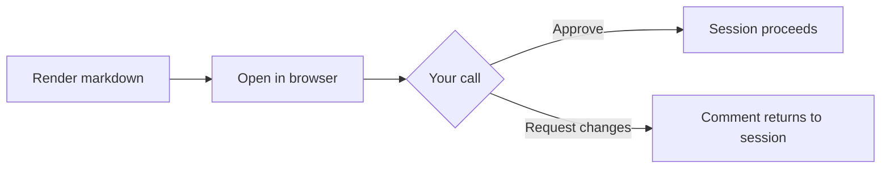

# Quarterly Roadmap — Draft for Review

> A short, representative document so you can see how **mdview** renders content and where
> the review controls live.

## Summary

We're proposing three workstreams for next quarter. Please **Approve** if this looks right,
or **Request changes** with a note and the comment comes straight back to the session.

## Workstreams

1. **Onboarding revamp** — cut time-to-first-value from 9 min to under 3.
2. **Billing migration** — move legacy invoices onto the new ledger.
3. **Mobile parity** — close the remaining 12 gaps with the web app.

| Workstream         | Owner   | Risk   | Target   |
| ------------------ | ------- | ------ | -------- |
| Onboarding revamp  | Dana    | Low    | Week 4   |
| Billing migration  | Priya   | High   | Week 8   |
| Mobile parity      | Marcus  | Medium | Week 10  |

## A code sample renders too

```go
func Approve(v Verdict) bool {
    return v.Verdict == "approve"
}
```

## And so do diagrams



> When you click a button below, this page reports your verdict back to Claude Code and the
> tab can be closed.
